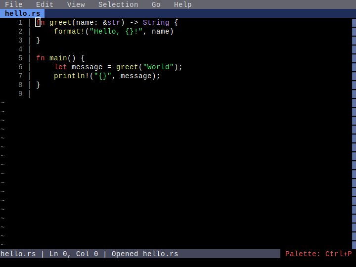

# Multi-Language Highlighting

**Category**: Syntax Highlighting

*Syntax highlighting working across all supported programming languages*

---

## Step 1: rust_highlighting

*Rust code with syntax highlighting*

